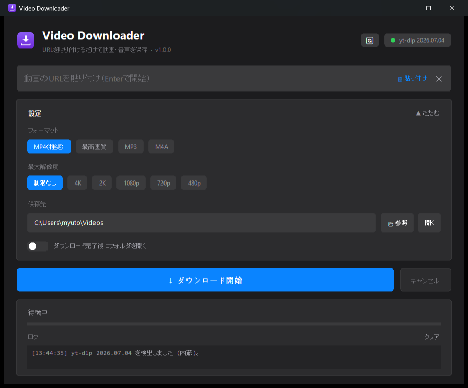

# Video Downloader

[](https://github.com/myuto2490/VideoDownloader/releases/latest)
[](LICENSE)
[](https://github.com/myuto2490/VideoDownloader/releases/latest)

URL を貼り付けるだけで動画・音声を保存できるデスクトップアプリです（**Windows / macOS 対応**）。
[yt-dlp](https://github.com/yt-dlp/yt-dlp) を内蔵しています。

- **macOS**: Apple Human Interface Guidelines に沿った **ネイティブ（Aqua）UI**。システム標準のコントロール・SF システムフォント・アクセントカラーを使い、**ライト/ダークは macOS の設定に自動追従**します。
- **Windows**: HIG に着想を得たダークテーマの GUI。



## ダウンロード（利用者向け）

### Windows

環境構築は不要です。Python のインストールも必要ありません。

1. [Releases](../../releases/latest) から `VideoDownloader.zip` をダウンロード
2. 好きな場所に展開して `VideoDownloader.exe` を実行

これだけで動画の保存・結合・MP3 変換まですべて使えます。
**ffmpeg も zip に同梱**されているため、追加のインストールは一切不要です。

> 万一 ffmpeg が見つからない環境（exe 単体をコピーした場合など）でも、
> 初回起動時に [yt-dlp 公式ビルド](https://github.com/yt-dlp/FFmpeg-Builds) を
> 自動ダウンロードしてセットアップします。

### macOS

**おすすめは `.app` にして `/Applications` へ入れる方法**です（Launchpad・Spotlight・
Dock から普通の Mac アプリとして起動できます）。

1. このリポジトリを取得（`git clone` または「Code ▸ Download ZIP」で展開）
2. ターミナルでリポジトリに移動して以下を実行

   ```sh
   ./build_mac.sh --install
   ```

これで `/Applications/VideoDownloader.app` が作られます。Python を別途入れる必要は
なく、アプリ単体で動きます（`--install` を付けなければ `dist/` に作るだけ）。

- 設定と yt-dlp の更新は `~/Library/Application Support/VideoDownloader/` に保存され、
  アプリ本体（`.app`）は書き換えません。
- アンインストールは `/Applications/VideoDownloader.app` をゴミ箱に入れるだけです。

ビルドせずに **その場で試したい** ときは `run_mac.command` を **ダブルクリック**
してください。初回だけ必要なもの（`yt-dlp` と `ffmpeg`）を自動でセットアップしてから
起動します。2 回目以降はすぐ起動します。

- ffmpeg は [Homebrew](https://brew.sh) があれば `brew install ffmpeg` で導入し、
  無ければアプリ内で自動ダウンロードします。
- GUI には **新しい Tk（8.6 以上）** が必要です。無ければランチャーが Homebrew の
  `python-tk` を自動導入します。
  （macOS 標準の Tk 8.5 は最近の macOS でウィンドウが真っ黒になる不具合があるため使いません）

> **`"開発元を確認できないため開けません"` と出たら**
> `run_mac.command` を **右クリック →「開く」** を選ぶと、以降ふつうに起動できます。
> （ダウンロードしたスクリプトに対する macOS の初回確認です）

macOS を単体の **`.app`** にまとめたい場合は、下記「[macOS の .app をビルド](#macos-の-app-をビルド)」を参照してください。

## 主な機能

- URL 貼り付け（クリップボード自動検出）だけの簡単操作
- フォーマット選択: MP4 / 最高画質 / MP3 / M4A
- 最大解像度の指定（480p〜4K）
- ダウンロードの進行状況表示（％・サイズ・速度・残り時間・処理段階）
- 実行ログ表示

## yt-dlp の更新について

YouTube などのサイトは仕様が頻繁に変わるため、**yt-dlp は定期的な更新が必要**です。
このアプリはアプリ本体を再インストールせずに yt-dlp だけを更新できます。

- 起動時に新バージョンを自動チェックし、右上のバッジとログでお知らせします
- 右上の **🔄 ボタン** を押すと、PyPI から最新の yt-dlp をダウンロードして
  exe と同じフォルダの `libs/` に展開します（アプリ再起動後に有効）
- `libs/` のコピーが壊れている場合は、exe 内蔵のバージョンに自動フォールバックします

## 開発者向け

### 必要環境

- Python 3.9+（Windows のビルドは 3.13。macOS は Tk 8.6 が使える Python 推奨）
- `pip install yt-dlp pyinstaller`
- 動画の結合・MP3 変換に `ffmpeg`（無ければアプリが自動取得）

> `video_downloader.py` は Windows / macOS / Linux 共通の 1 ファイルです。
> フォント・ffmpeg の取得先・保存先フォルダを開く処理などを OS ごとに切り替えます。

### ソースから実行

```sh
python video_downloader.py
```

macOS では `run_mac.command` をダブルクリックすると、仮想環境の作成・
`yt-dlp` / `ffmpeg` の用意・起動までを自動で行います。

### exe のビルド（Windows）

```sh
python -m PyInstaller VideoDownloader.spec --noconfirm
```

`dist/VideoDownloader.exe` が生成されます。

### macOS の .app をビルド

```sh
./build_mac.sh            # dist/VideoDownloader.app を生成
./build_mac.sh --install  # 生成して /Applications にインストール
```

内部で `make_icns.py` により `icon.icns` を生成し、`VideoDownloader-mac.spec` で
ビルドしたあと **ad-hoc 署名**（`codesign --sign -`）します。Apple Developer ID による
署名ではないため、他人の Mac に配る場合は初回だけ 右クリック →「開く」、または
`xattr -dr com.apple.quarantine <app のパス>` が必要です。

`.app` として動いているときは、書き込みが必要なもの（`.vd_config` と更新した
yt-dlp／自動取得した ffmpeg）を `~/Library/Application Support/VideoDownloader/` に
置きます。バンドル内を書き換えるとコード署名が壊れるためです。
ffmpeg は Finder から起動した `.app` の `PATH` に Homebrew が入らないので、
`/opt/homebrew/bin` と `/usr/local/bin` も直接探します。

### リリース手順（バージョン管理）

1. `video_downloader.py` の `APP_VERSION` を更新
2. コミットしてタグを打つ:

   ```sh
   git tag v1.0.1
   git push origin main --tags
   ```

3. GitHub Actions が自動で exe をビルドし、Release に `VideoDownloader.zip` を添付します

## 免責事項

本アプリは私的利用の範囲でご使用ください。ダウンロードするコンテンツの権利・
各サービスの利用規約は利用者自身の責任で確認してください。

## ライセンス

[MIT License](LICENSE)

本アプリは [yt-dlp](https://github.com/yt-dlp/yt-dlp)（Unlicense）を利用しています。
同梱の ffmpeg バイナリは [yt-dlp/FFmpeg-Builds](https://github.com/yt-dlp/FFmpeg-Builds)
のビルド（GPL）です。ライセンス全文は zip 内の `FFMPEG_LICENSE.txt` を参照してください。
